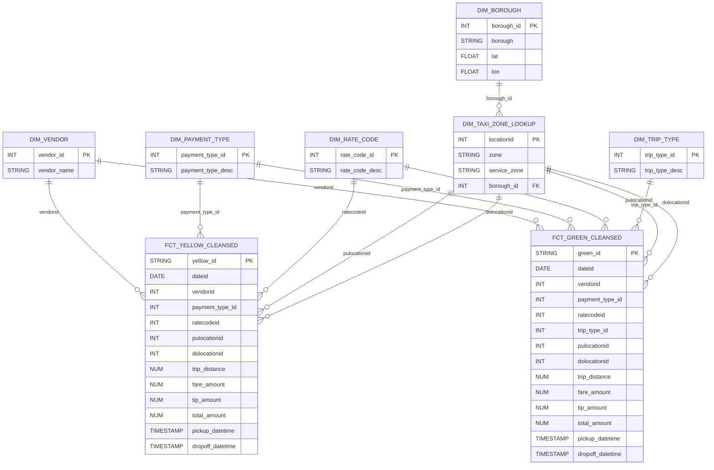
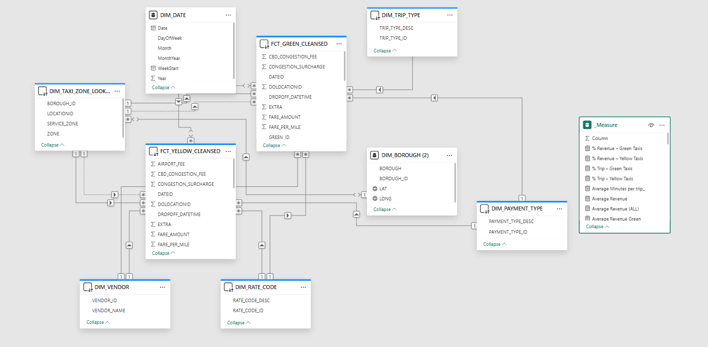
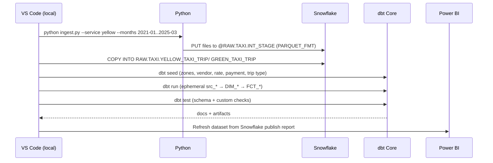

# NYC Taxi Analytics Pipeline (NYC TLC → Snowflake → dbt → Power BI) 

> **Elevator pitch:** I built an *end‑to‑end analytics pipeline* that scrapes NYC Taxi data, lands it in **Snowflake**, transforms it with **dbt** (including data quality gates, incremental facts, and seeded dimensions), enriches boroughs with **Wikidata (SPARQL)** coordinates, and serves an **executive‑grade Power BI** report. The project demonstrates practical data engineering, analytics engineering, and BI delivery—ready for production.

---

## 🧠 What this project proves (skills & tooling)

- **Data Acquisition:** Python (requests, pandas/pyarrow) web scraping + file management.
- **Cloud Warehousing:** **Snowflake** database design (`RAW`), stages, file formats, COPY INTO, VARIANT parsing.
- **Transformation & Testing:** **dbt** (ephemeral staging, seeded dims, incremental fact models, `dbt_utils`), schema + custom tests, documentation.
- **Geospatial Enrichment:** **Wikidata SPARQL** to obtain exact borough latitude/longitude.
- **Business Intelligence:** **Power BI** star‑schema modeling, DAX, and a curated set of executive/ops dashboards.
- **Software Craft:** Git + VS Code development workflow, clear repo layout, reproducible instructions, performance & cost awareness.

---

## 🗺️ System Architecture

### High‑level flow


---


### Star schema (analytical model)


### Star schema (Power BI model)



### Orchestration (run order)


---

## 🔧 Key implementation details (code you’ll find in this repo)

### 1) Python scraping (parameterized)
- **Libraries:** `requests`, `pandas`, `pyarrow` (writes Parquet), optional `snowflake-connector-python` or `snowsql` for loading.
- **Pattern:** loop months/services → download → validate → persist to `data/ingest/` as Parquet.
- **Why Parquet?** Strong typing, compression, faster COPY into Snowflake.

### 2) Snowflake landing (RAW)
- **Objects:** `RAW` database, `RAW.TAXI` schema, `PARQUET_FMT` file format, `INT_STAGE` internal stage.
- **Load strategy:** Upload (`PUT`) → `COPY INTO` a **VARIANT** column table or typed table.  
  In this project I parse Parquet into a **VARIANT** column and normalize with dbt `src_*` models.

### 3) dbt project (VS Code)
- **Staging models** (`src_yellow_trip.sql`, `src_green_trip.sql`) are **ephemeral**; they cast VARIANT fields to proper Snowflake types and standardize timestamps.
- **Seeds** (`src_vendor.sql`, `src_payment_type.sql`, `src_rate_code.sql`, `src_trip_type.sql`) define authoritative small lookup tables in‑project.
- **Dimensions** are **views** for agility: vendor, payment type, rate code, trip type, borough, taxi zone lookup.
- **Facts** (`fct_yellow_cleansed.sql`, `fct_green_cleansed.sql`) are **incremental** tables with:
  - **Grain:** one row per trip after deduplication via a **surrogate key** (vendor, payment, datetimes, passenger count, tip, PU/DO, fare/mi).
  - **Data quality gates:** non-negative values, plausible speeds (1–80 mph), realistic durations (1–480 mins), distance ≤ 100 miles, and **total amount reconciles** to the sum of parts (±$0.01).
  - **Feature engineering:** trip_minutes, trip_hours, mph, fare_per_mile.
  - **Time filters:** exclude future timestamps; **incremental** backfill uses `MAX(pickup_datetime)`.

### 4) Geospatial enrichment (Wikidata SPARQL)
- I query borough Q‑IDs for their **P625 (coordinates)** and join to `DIM_BOROUGH` for accurate centroid mapping in BI.
- Stored as a small lookup table and referenced by `DIM_TAXI_ZONE_LOOKUP` via borough relationships.

query (simplified):

```sparql
SELECT ?borough ?boroughLabel ?coord WHERE {
  VALUES ?borough { wd:Q18424 wd:Q18435 wd:Q18438 wd:Q18442 wd:Q18426 } # NYC borough Q-ids
  ?borough wdt:P625 ?coord .
  SERVICE wikibase:label { bd:serviceParam wikibase:language "en". }
}
```

- Results were joined to the zone/borough dimension to produce **exact points** for **centroid mapping** and disambiguation.  
- Stored in a lookup table (e.g., `RAW.TAXI.BOROUGH_COORDS`) and joined in `dim_borough.sql`.

### 5) Testing & documentation
- **dbt tests:** `unique`, `not_null`, `relationships` (FK coverage), and custom **expression** tests for business rules (e.g., fare ≥ 0, duration logic).
- **Docs:** YAML documentation for columns + model descriptions; `dbt docs generate` produces a browsable lineage graph.

---

## 🧪 Representative SQL (trimmed)

### Fact — Yellow (incremental with quality gates)
```sql
-- fct_yellow_cleansed.sql (key ideas)
WITH src AS (
  SELECT ... FROM {{ ref('src_yellow_trip') }}
  WHERE pickup_datetime IS NOT NULL
    AND dropoff_datetime IS NOT NULL
    AND YEAR(pickup_datetime) >= 2021
    AND passenger_count BETWEEN 1 AND 8
    AND pickup_datetime < dropoff_datetime
    AND pickup_datetime < CURRENT_TIMESTAMP
    AND dropoff_datetime < CURRENT_TIMESTAMP
  
    AND pickup_datetime > (SELECT COALESCE(MAX(pickup_datetime),'1900-01-01') FROM {{ this }})
  
),
features AS (
  SELECT *, datediff('second', pickup_datetime, dropoff_datetime)/60.0 AS trip_minutes,
         ... , CASE WHEN trip_distance>0 THEN fare_amount/trip_distance END AS fare_per_mile
  FROM src
),
filtered AS (
  SELECT * FROM features
  WHERE trip_distance <= 100
    AND trip_minutes BETWEEN 1 AND 480
    AND (mph IS NULL OR (mph BETWEEN 1 AND 80))
    AND (fare_per_mile IS NULL OR fare_per_mile BETWEEN 0.5 AND 20)
    AND ABS(total_amount - (COALESCE(fare_amount,0)+COALESCE(tip_amount,0)+COALESCE(tolls_amount,0)
      + COALESCE(extra,0)+COALESCE(mta_tax,0)+COALESCE(improvement_surcharge,0)
      + COALESCE(congestion_surcharge,0)+COALESCE(cbd_congestion_fee,0)+COALESCE(Airport_fee,0))) < 0.01
)
SELECT
  {{ dbt_utils.generate_surrogate_key([...]) }} AS yellow_id,
  CAST(pickup_datetime AS DATE) AS DateID,
  *
FROM filtered
QUALIFY COUNT(*) OVER (PARTITION BY {{ dbt_utils.generate_surrogate_key([...]) }}) = 1;
```

### Source — Yellow (ephemeral VARIANT parsing)
```sql
WITH src_yellow_trip AS (
  SELECT
    VARIANT_COL:"VendorID"::int AS VendorID,
    ...,
    TO_TIMESTAMP_NTZ(VARIANT_COL:"tpep_pickup_datetime"::number/1000000.0) AS pickup_datetime,
    TO_TIMESTAMP_NTZ(VARIANT_COL:"tpep_dropoff_datetime"::number/1000000.0) AS dropoff_datetime
  FROM NYC_TAXI.RAW.YELLOW_TAXI_TRIP
)
SELECT * FROM src_yellow_trip;
```

### Taxi Zone Lookup — fuzzy borough matching
```sql
SELECT t.LOCATIONID, t.ZONE, t.SERVICE_ZONE, b.BOROUGH_ID
FROM TLC.RAW.TAXI_ZONE_LOOKUP t
LEFT JOIN NYC_TAXI.RAW.DIM_BOROUGH b
ON UPPER(TRIM(t.borough)) = UPPER(TRIM(b.BOROUGH))
   OR (UPPER(TRIM(t.borough)) = 'MANHATTAN' AND UPPER(TRIM(b.BOROUGH)) LIKE '%MANHATTAN%')
   -- ...additional borough equivalences & gentle wildcard matching...
;
```

---

## 📊 Power BI (visuals embedded)

- **Executive Overview** — KPIs, YoY deltas, monthly trend
  
  

- **Geographic Insights** — Top pickup/dropoff zones + map (uses Wikidata coords)
  
  

- **Fare & Revenue Analysis** — Component breakdown, Avg fare/mile vs distance, fare distribution
  
  

- **Passenger & Trip Behavior** — Trip distance distribution, passenger count patterns, distance vs fare
  
  

- **Operational Performance** — Congestion surcharge trend, vendor x payment insights, top tolls by zone
  
  

---

## 🧭 How to run (end‑to‑end)

### 0) Prereqs
- Snowflake account + role with create privileges
- Python 3.10+ (`pip install -r requirements.txt`) → `requests`, `pandas`, `pyarrow`, `snowflake-connector-python` or have **SnowSQL** CLI
- `dbt-core` + `dbt-snowflake`
- Power BI Desktop (or Service + Gateway)

### 1) Ingest
```bash
# Example: download a date range for both services to data/ingest
python ingest.py --service yellow --from 2021-01 --to 2025-03
python ingest.py --service green  --from 2021-01 --to 2025-03
```

### 2) Snowflake objects
```sql
CREATE WAREHOUSE IF NOT EXISTS WH_XS WITH WAREHOUSE_SIZE='XSMALL' AUTO_SUSPEND=60 AUTO_RESUME=TRUE;
CREATE DATABASE IF NOT EXISTS RAW;
CREATE SCHEMA IF NOT EXISTS RAW.TAXI;
CREATE OR REPLACE FILE FORMAT RAW.TAXI.PARQUET_FMT TYPE='PARQUET';
CREATE OR REPLACE STAGE RAW.TAXI.INT_STAGE FILE_FORMAT=RAW.TAXI.PARQUET_FMT;
```

Upload & load:
```bash
snowsql -q "PUT file://data/ingest/* @RAW.TAXI.INT_STAGE AUTO_COMPRESS=TRUE"
```

Create raw tables (VARIANT) and copy:
```sql
CREATE OR REPLACE TABLE RAW.TAXI.YELLOW_TAXI_TRIP (VARIANT_COL VARIANT);
CREATE OR REPLACE TABLE RAW.TAXI.GREEN_TAXI_TRIP  (VARIANT_COL VARIANT);

COPY INTO RAW.TAXI.YELLOW_TAXI_TRIP FROM @RAW.TAXI.INT_STAGE PATTERN='.*yellow.*parquet';
COPY INTO RAW.TAXI.GREEN_TAXI_TRIP  FROM @RAW.TAXI.INT_STAGE PATTERN='.*green.*parquet';
```

### 3) dbt
Update `profiles.yml` with Snowflake credentials → then:
```bash
dbt seed         # loads lookup/zone seeds
dbt run          # builds dims + facts (src_* are ephemeral)
dbt test         # schema & custom tests
dbt docs generate && dbt docs serve
```

### 4) Power BI
- Connect to Snowflake (facts & dims).
- Build/report using the pages above. Publish to service and schedule refresh.


---

## ✅ Data quality & governance

- **Tests**
  - **Schema:** `not_null`, `unique`, `accepted_values`
  - **Relationships:** facts → dims (`relationships` tests)
  - **Assertions:** expression tests on fares, distance, duration, speed, and total reconciliation
- **Freshness:** incremental loading by `pickup_datetime`
- **Docs:** dbt model descriptions + column-level YAML
- **Security:** separate roles for ingestion, dbt, and BI; warehouse auto‑suspend for cost control

---

## 🧩 Design decisions & trade‑offs

- **Ephemeral staging** keeps Snowflake tidy and shifts logic directly into facts—great for development speed.
- **Incremental MERGE** on trip date/time dramatically reduces compute on re‑runs.
- **Parquet + VARIANT** provides schema flexibility across monthly files.
- **Fuzzy borough join** handles real‑world text inconsistencies between sources.
- **Wikidata enrichment** guarantees consistent geocoding without 3rd‑party APIs.

---

## 📈 Results (examples you can speak to in interviews)

- Clear **YoY growth trends** and seasonality visible in Executive Overview.
- **Top 10 zones** account for a large share of trips/revenue—supports focused ops strategies.
- **Payment mix** and **vendor share** reveal behavior differences that affect tips and throughput.
- **Congestion surcharge** trends highlight policy impacts month‑to‑month.

---

## 📬 Contact
If you’d like a brief walkthrough or want to discuss extensions (incremental partitioning, CI/CD with dbt Cloud/GitHub Actions, external stages on S3/GCS), I’m happy to chat.

_— Adewole Benjamin Oyediran (Bensha2019@outlook.com)
